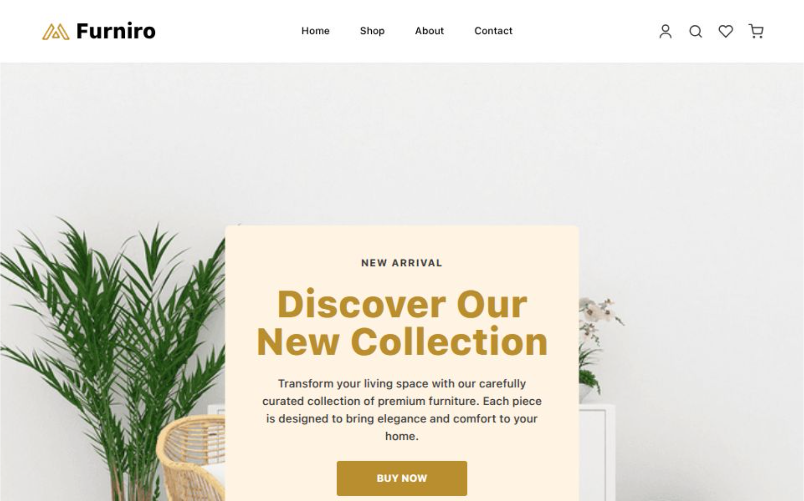

# Furniro - Furniture E-Commerce

Modern furniture e-commerce website built with Next.js, TypeScript, and Tailwind CSS. A full-featured shopping experience with cart management, wishlist, checkout flow, and contact form.



## ✨ Features

### Core Features
- 🛍️ **Product Catalog** - Browse products with filtering and search functionality
- 🛒 **Shopping Cart** - Add items, update quantities, and manage cart items
- ❤️ **Wishlist** - Save favorite products for later
- 📝 **Checkout Flow** - Complete checkout with billing details and payment options
- 📧 **Contact Form** - Reach out with a fully functional contact form
- 📱 **Fully Responsive** - Works seamlessly on desktop, tablet, and mobile devices

### Advanced Features
- 💾 **Data Persistence** - Cart and wishlist persist across page refreshes using localStorage
- ✅ **Form Validation** - Client-side and server-side validation for all forms
- 🔔 **Toast Notifications** - Beautiful toast notifications with progress indicators
- ⚡ **Loading States** - Loading indicators for all async operations
- 🛡️ **Error Handling** - Comprehensive error handling with user-friendly messages
- 🎨 **Modern UI** - Clean, modern design with smooth animations

## 🛠️ Tech Stack

- **Next.js 14** - React framework with App Router
- **TypeScript** - Type-safe development
- **Tailwind CSS** - Utility-first CSS framework
- **React Context API** - State management for cart and wishlist
- **Next.js API Routes** - Server-side API endpoints

## 🚀 Getting Started

### Prerequisites

- Node.js 18+ 
- npm or yarn

### Installation

1. Clone the repository:
```bash
git clone <repository-url>
cd Furniro
```

2. Install dependencies:
```bash
npm install
```

3. Run the development server:
```bash
npm run dev
```

4. Open [http://localhost:3000](http://localhost:3000) in your browser

### Build for Production

```bash
npm run build
npm start
```

## 📁 Project Structure

```
Furniro/
├── app/                    # Next.js App Router pages
│   ├── api/               # API routes
│   │   └── contact/       # Contact form API endpoint
│   ├── cart/              # Cart page
│   ├── checkout/          # Checkout page
│   ├── contact/           # Contact page
│   ├── products/          # Product detail pages
│   ├── shop/              # Shop/Product listing page
│   └── wishlist/          # Wishlist page
├── components/            # React components
│   ├── icons/             # Icon components
│   ├── CartItem.tsx       # Cart item component
│   ├── ContactForm.tsx    # Contact form component
│   ├── ErrorBoundary.tsx  # Error boundary component
│   ├── LoadingSpinner.tsx # Loading spinner component
│   └── ...                # Other components
├── contexts/             # React Context providers
│   ├── CartContext.tsx    # Cart state management
│   └── WishlistContext.tsx # Wishlist state management
├── data/                 # Static data
│   └── products.ts       # Product data
└── public/               # Static assets
    └── images/           # Image files
```

## 🔌 API Documentation

### Contact Form API

**Endpoint:** `POST /api/contact`

**Request Body:**
```json
{
  "name": "John Doe",
  "email": "john@example.com",
  "subject": "Inquiry",
  "message": "Your message here"
}
```

**Success Response (200):**
```json
{
  "success": true,
  "message": "Your message has been sent successfully. We'll get back to you soon!"
}
```

**Error Response (400):**
```json
{
  "success": false,
  "message": "Validation failed",
  "errors": {
    "name": "Name is required",
    "email": "Please enter a valid email address"
  }
}
```

## 📋 Features in Detail

### Shopping Cart
- Add products to cart
- Update item quantities
- Remove items from cart
- View cart totals
- Persistent cart (survives page refresh)

### Wishlist
- Add/remove products from wishlist
- View wishlist items
- Persistent wishlist (survives page refresh)

### Checkout
- Billing details form with validation
- Payment method selection
- Order summary
- Order placement with data persistence

### Product Catalog
- Product filtering by category
- Price range filtering
- Search functionality
- Product detail pages
- Related products

## 🎯 Key Implementation Details

### Data Persistence
- Cart and wishlist data are stored in `localStorage`
- Data automatically syncs on page load and changes
- Graceful error handling if localStorage is unavailable

### Form Validation
- Client-side validation for immediate feedback
- Server-side validation for security
- Inline error messages
- Email and phone number format validation

### Error Handling
- Global error boundary for unexpected errors
- Try-catch blocks for async operations
- User-friendly error messages
- Toast notifications for user feedback

## 🚢 Deployment

### Vercel (Recommended)

1. Push your code to GitHub
2. Import your repository in Vercel
3. Vercel will automatically detect Next.js and configure settings
4. Deploy!

### Other Platforms

The app can be deployed to any platform that supports Next.js:
- Netlify
- AWS Amplify
- Railway
- DigitalOcean App Platform

## 📝 Environment Variables

Currently, no environment variables are required. For production, you may want to add:
- Database connection strings
- Email service API keys
- Payment gateway credentials

## 🤝 Contributing

1. Fork the repository
2. Create a feature branch (`git checkout -b feature/amazing-feature`)
3. Commit your changes (`git commit -m 'Add some amazing feature'`)
4. Push to the branch (`git push origin feature/amazing-feature`)
5. Open a Pull Request

## 📄 License

This project is open source and available under the MIT License.

## 🙏 Acknowledgments

- Design inspiration from modern e-commerce platforms
- Built with Next.js and React
- Styled with Tailwind CSS

---

**Note:** This is a case study project. For production use, consider adding:
- User authentication
- Database integration
- Payment gateway integration
- Email notifications
- Order management system
- Admin dashboard
